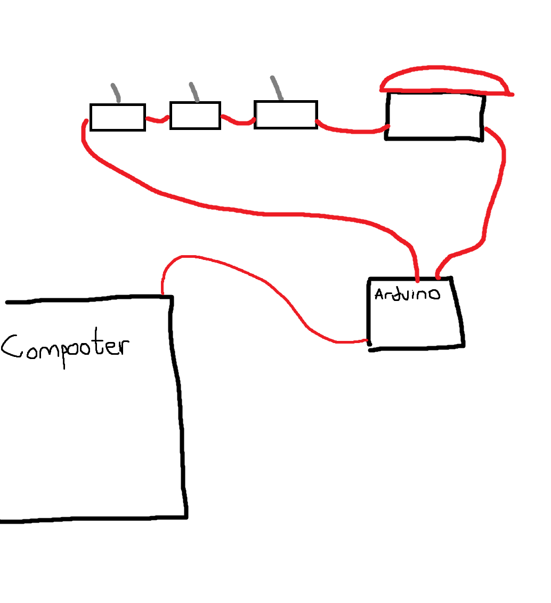

# Touch Grass Button

## Overview
This project is the final result of my mission to help *other people* with ragequitting problems in videogames (totally not made for myself). It plugs into the computer via USB, and when all 3 switches are switched and the button is pressed, it closes whatever program is active. The button is completely from scratch, and uses opposing magnets to return to its un-pushed state. The project is covered in faux turf, to allow on to *touch grass* before the ultimately decide to rage quit.
## Project Recap Video
[Project Recap Video](https://www.youtube.com/watch?v=1RJNKyy3B7o)
## CAD Files
[CAD Files on Thingiverse](https://www.thingiverse.com/thing:6617027)

## Code
The code works by continuously polling the digital 2 pin of the Arduino until it reads as low. The pin reads as low when it is connected to ground - which is what flipping the switches and pushing the button does. After the Arduino reads low, it sends a message to a Finite State Machine that is used to [debounce](https://www.techtarget.com/whatis/definition/debouncing). The finite state machine will ultimately be the one that sends the keyboard shortcut to the computer.

### Debounce
The reason for a debounce is standard on buttons. When you push a button and hold it, you want it to count as 1 push. But, electronics aren't perfect (especially on smaller scales), and when you push the button, the contacts may "tap" eachother a couple times (this happens on a multiple-times-per-millisecond level). If we didn't have a debounce, this would result in the circuit reading the button thinking that it was pushed numerous times. A trivial solution to debounce is to use some form of timer that will essentially ignore any button pushes that are too close together in time.

## Schematic
The circuit is very simple - the Arduino's digital 2 pin is connected to the positive end of the first switch. Then, the negative of that switch is connected to the positive of the next, which is then repeated once more for the third switch. From the negative end of the third switch, it connects to a wire haphazardly glued onto the button. When the button is pushed, that wire comes in contact with another wire that is glued to the frame that holds the button on axis. This last wire is connected to the arduino ground pin. Thus, when all the switches are switched AND the button is pushed, the circuit is closed.

My electrical engineering professors would be extremely proud of this schematic.